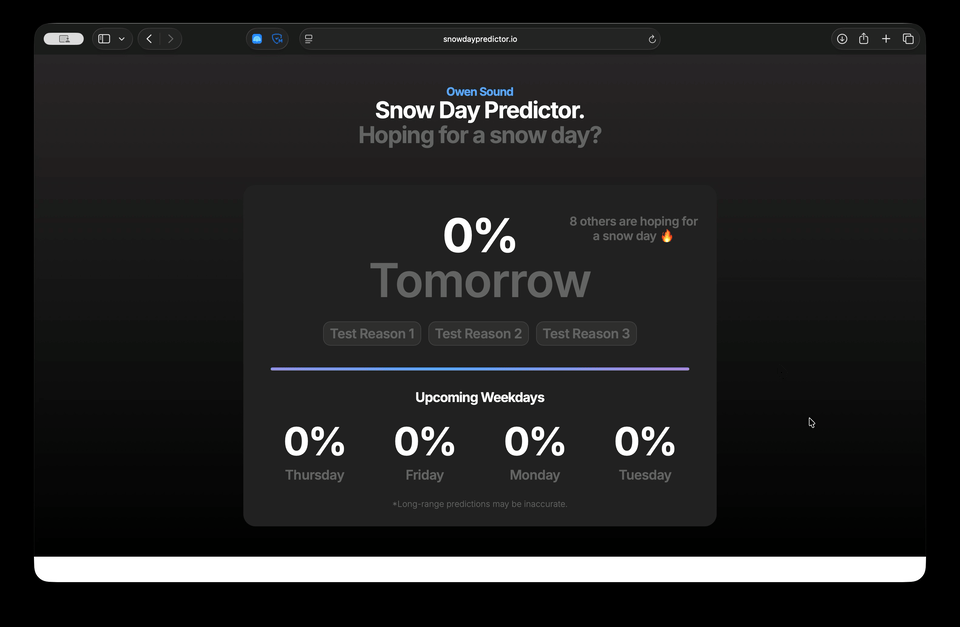

# Canada's Unofficial Snow Day Predictor

Snow Day Predictor is a machine learning project that estimates the probability of school closures due to winter weather. Trained on weather data from Winter 2024 and 2025, the model considers factors such as temperature, snowfall amounts, overnight accumulation, and wind speed, then outputs a probability score for upcoming weekdays.
## Website

[Try it out, it's live!](https://snowdaypredictor.io)

  
  

## Features

- Accurate Next-Day Snow Day Prediction
- Prediction Explanations
- Next-Day Prediction Explanations
- Long-Range Snow Day Predictions
- Support for all cities across Canada
- Feedback Submission

## Upcoming Features

- Environment Canada Weather Warning Awareness
- Data Visualization

## Resources

 - [Open Meteo Weather API](https://open-meteo.com)
 - [Scikit Learn AI](https://scikit-learn.org/stable/)
 - Server Hostong with [Fly](https://fly.io)
 - [Uptime Robot](http://uptimerobot.com)
 - Backend in Python
 - Frontend in HTML, Javascript, and CSS

